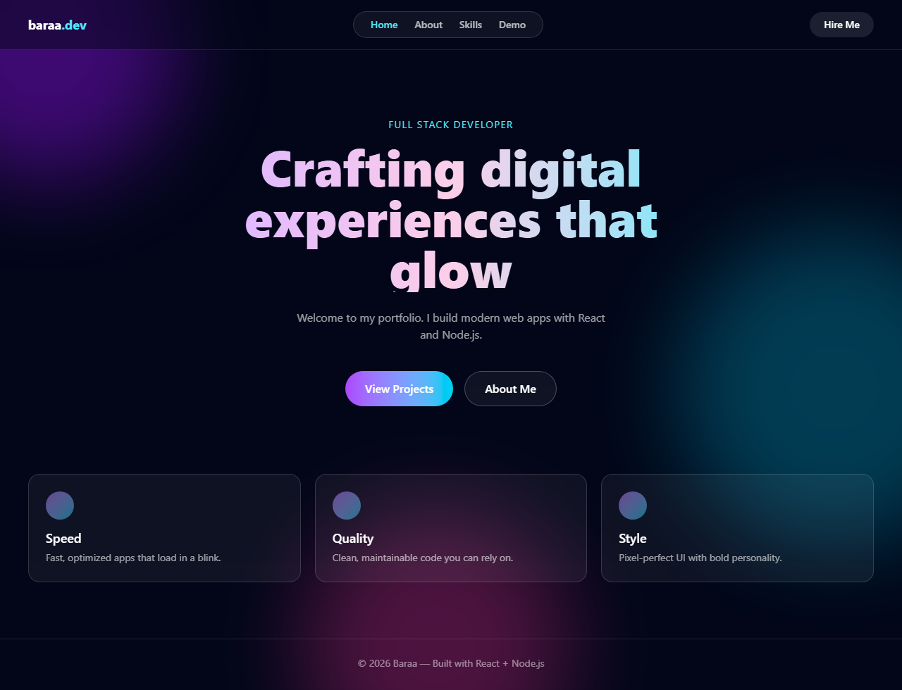
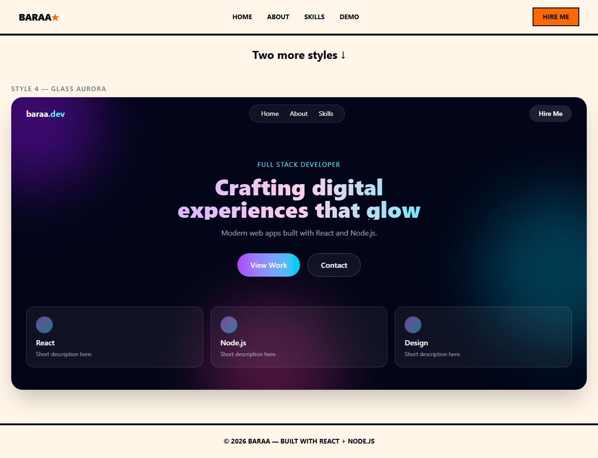

# Portfolio — Frontend


A personal portfolio website frontend built with React and Vite, featuring an animated **Glass Aurora** design system — frosted glass cards, glowing aurora background, and smooth page navigation.

> A Node.js backend is planned to power real contact-form submissions and dynamic content. See [Roadmap](#roadmap).

## Features

- Multi-page navigation with React Router (no full page reloads)
- Animated aurora background with drifting, color-cycling glow blobs
- Glassmorphism UI: frosted navbar, cards, and form panels
- Brand-colored tech icons (HTML5, CSS3, JavaScript, React, Node.js, Git)
- Fully responsive layout (mobile-first with Tailwind CSS)
- Contact / Hire Me page with client-side validated form
- Accessible: respects `prefers-reduced-motion`

## Preview

| Home | Skills |
| --- | --- |
|  |  |

More screenshots are available in the [`screenshots/`](screenshots) directory.

## Tech Stack

| Technology | Purpose |
| --- | --- |
| [React 19](https://react.dev) | UI library |
| [Vite 8](https://vite.dev) | Build tool & dev server |
| [Tailwind CSS 4](https://tailwindcss.com) | Utility-first styling |
| [React Router 7](https://reactrouter.com) | Client-side routing |
| [Lucide React](https://lucide.dev) & [React Icons](https://react-icons.github.io/react-icons/) | Icon libraries |

## Getting Started

### Prerequisites

- [Node.js](https://nodejs.org) 20 or newer
- npm (comes with Node.js)

### Installation

```bash
# 1. Clone the repository
git clone https://github.com/<your-username>/portfolio.git

# 2. Enter the frontend folder
cd portfolio/FrontEnd

# 3. Install dependencies
npm install

# 4. Start the dev server
npm run dev
```

Open http://localhost:5173 in your browser. The page hot-reloads as you edit.

## Available Scripts

| Command | Description |
| --- | --- |
| `npm run dev` | Start the development server |
| `npm run build` | Bundle for production into `dist/` |
| `npm run preview` | Preview the production build locally |
| `npm run lint` | Run oxlint checks |

## Project Structure

```
src/
├── Components/
│   ├── AuroraBackground.jsx   # Animated glowing backdrop shared by all pages
│   └── Navbar.jsx             # Sticky glassmorphism navigation bar
├── Pages/
│   ├── HomePage.jsx           # Hero section + feature cards
│   ├── AboutPage.jsx          # Bio, photo placeholder, stats
│   ├── SkillsPage.jsx         # Tech stack grid with brand icons
│   ├── DemoPages.jsx          # Experiments playground
│   └── HireMePage.jsx         # Contact info cards + message form
├── App.jsx                    # Router setup + layout shell
├── index.css                  # Tailwind import, theme colors, animations
└── main.jsx                   # Application entry point
```

## Design System

The app follows one consistent **Glass Aurora** theme:

| Element | Recipe |
| --- | --- |
| Background | `bg-slate-950` with animated gradient blobs |
| Cards / panels | `border-white/15 bg-white/5 backdrop-blur-md rounded-2xl` |
| Primary button | Gradient pill: `bg-gradient-to-r from-purple-500 to-cyan-400` |
| Secondary button | `border-white/25 bg-white/5` glass pill |
| Headings | Gradient text via `bg-clip-text text-transparent` |
| Accents | Cyan (`text-cyan-300`) and purple (`text-purple-300`) |

To keep new sections consistent, reuse these utility combinations from the table above.

## Roadmap

- [ ] Node.js / Express backend (contact form API)
- [ ] Projects page backed by a REST API
- [ ] Dark/light mode toggle
- [ ] Blog section

## Author

**Baraa** — Full Stack Developer

- GitHub: [@baraa](https://github.com/baraa)

---

Built as part of a full-stack portfolio journey: React on the front, Node.js on the back.
